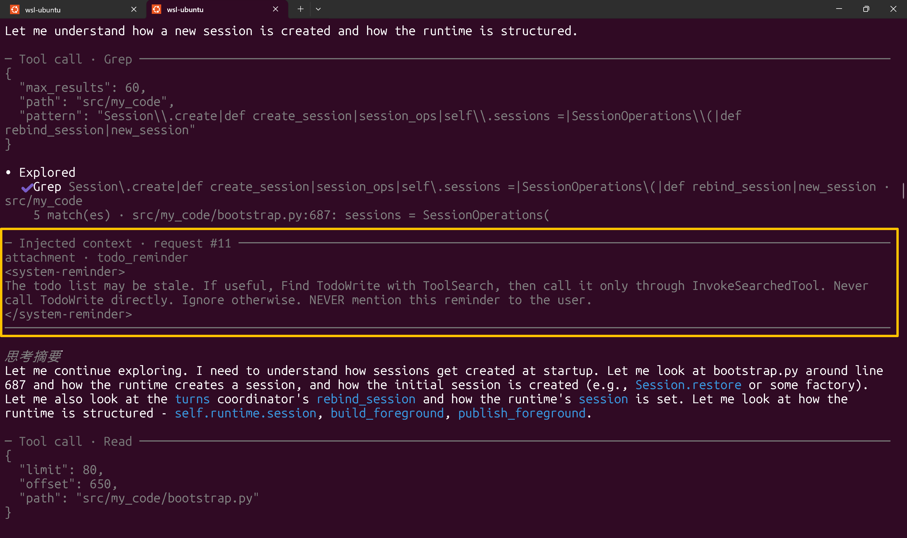
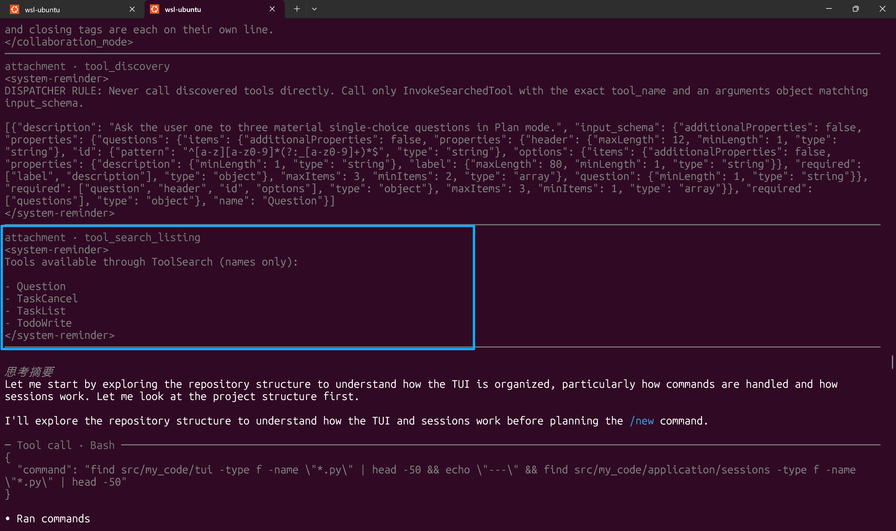
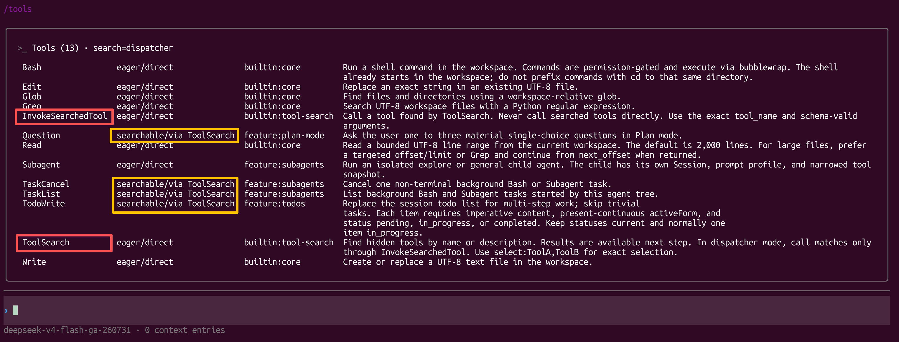
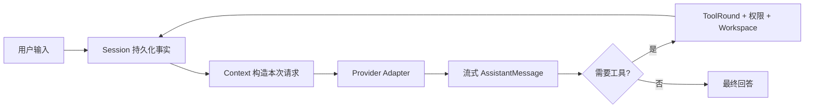

# my-code

> 一个模块化、类型安全、上下文透明的 Python Coding Agent。

**技术栈：** Python 3.12+ · asyncio · prompt_toolkit · Rich · Anthropic / OpenAI SDK · OpenTelemetry · uv · Ruff · Pyright · Tach

my-code 是一个运行在终端里的完整 Coding Agent。它能阅读和修改代码、执行命令、管理任务、调用 Subagent，并把 Session、上下文、工具调用和模型请求组织成清晰、可恢复、可审计的工作流。

它的核心理念很简单：模型能力应该足够强，运行过程也应该足够透明。你既可以直接用它完成开发任务，也可以沿着明确的领域边界阅读源码、替换 Provider、扩展工具，或者研究一个现代 Coding Agent 如何运转。

## 为什么选择 my-code

| | my-code 的设计 |
| --- | --- |
| **Glass-box** | 系统提示、自动注入的上下文、ToolCall、权限决策和模型请求都有明确来源与展示入口 |
| **Provider-neutral** | 同一套 Agent core 支持 Anthropic Messages、OpenAI Responses 与兼容网关 |
| **原生终端体验** | `prompt_toolkit + Rich` 构建交互界面，保留 terminal scrollback 与自然的命令行操作 |
| **可靠的长任务** | 持久化 Session、自动 Compact、后台任务、Subagent 和取消树共同支撑多 step 工作流 |
| **统一扩展边界** | 内置工具、MCP、Skills、Todo、Subagent 与后台任务共享工具、权限和结果闭合机制 |
| **缓存友好的工具发现** | 高频工具保持稳定直连，低频工具按需搜索并通过统一入口执行，提升请求前缀的缓存复用空间 |
| **可验证架构** | 类型检查、依赖图、源码所有权守卫和完整测试套件持续验证架构约束 |

## 看见 Agent 真正收到的上下文

Agent 的行为不仅取决于用户输入，也会受到运行时上下文的影响。my-code 的 `/view detailed` 会在每次模型请求前展示本轮新增或变化的注入内容，包括 AGENTS 指令、文件 Attachment、Todo/Skill 提示、工具发现结果和后台任务通知；每一项都标注所属 request 与来源。

下面的 `todo_reminder` 由运行时自动注入。它对模型可见，因此在 Detailed 视图中也对用户可见：



*黄色区域是 request #11 的注入上下文。Concise 视图保持日常交互简洁，Detailed 视图则清晰展示 Agent 获得了哪些额外指令。*

## 快速开始

准备 Python 3.12+、[uv](https://docs.astral.sh/uv/) 和任意受支持的 Provider。

### 安装运行

```bash
uv tool install git+https://github.com/0614GS/my-code.git
mycode
```

首次启动会进入 Provider 向导。选择 Anthropic Messages 或 OpenAI Responses，填写 Endpoint 和 API key，选择模型后即可进入主界面。

进入会话后：

- 直接描述任务，让 Agent 阅读、修改并验证代码；
- 输入 `/` 浏览所有命令；
- 使用 `@path` 将文件或目录加入当前输入；
- 使用 `/view detailed` 检查自动注入的上下文，使用 `/tools` 查看工具暴露方式；
- 使用 `/provider` 管理连接，使用 `/model` 即时切换模型；
- 使用 `/resume` 恢复 Session，使用 `/context` 查看上下文状态；
- 使用 `/tasks` 和 `/agents` 跟踪后台工作与 Subagent。

### 从源码开发

```bash
git clone https://github.com/0614GS/my-code.git
cd my-code
uv sync --group dev
uv run mycode
```

## 稳定前缀，按需扩展工具集

工具数量增长时，把每个 schema 都常驻在模型请求中会持续占用 token；动态增减 definition 还会改变请求前缀，缩小 Provider 前缀缓存的复用空间。my-code 的 dispatcher 模式把高频能力与按需能力分开，让工具集可以持续扩展，同时保持请求前部稳定。

### 先告诉模型有哪些工具

每当 searchable 工具集合发生变化，my-code 会注入一份只包含名称的 `tool_search_listing`。模型由此知道哪些能力可以通过 `ToolSearch` 获取；低频工具先以名称占位，完整 description 和 input schema 只在命中后进入上下文。



*蓝色区域是轻量的工具名称清单；模型搜索其中的 `Question` 后，匹配的完整 schema 才作为上方 `tool_discovery` 内容进入后续请求。两部分在 Detailed 视图中都有明确来源。*

### 再通过稳定入口执行

高频核心工具以 `eager/direct` 方式直接暴露；`ToolSearch` 和 `InvokeSearchedTool` 也保持为固定 definition。模型找到目标后，通过 `InvokeSearchedTool` 提交准确的 `tool_name` 与参数，搜索结果则作为可追踪的 discovery 内容在请求尾部演进。

```text
工具名称清单 → ToolSearch → 目标 schema → InvokeSearchedTool → ToolExecutor
```



*红色标出稳定的搜索与调用入口，黄色标出通过 ToolSearch 按需发现的工具。`/tools` 可以随时检查每个能力的暴露方式与来源。*

这种结构让 system prompt 与 direct tool definitions 保持稳定，为支持提示词缓存的 Provider 创造更好的复用条件。统一入口只负责路由，真实目标仍由同一个 ToolExecutor 完成 schema 校验、权限判断、审计、执行和结果闭合，因此 Builtin、Feature、MCP 和 Skill 始终共享一致的安全边界。

## 与 Claude Code 的不同

Claude Code 为终端 Coding Agent 建立了优秀的交互范式。my-code 延续了 Agent loop、权限确认、上下文压缩、Session 恢复、MCP、Skills 和 Subagent 等核心体验，同时选择了一条更开放、更适合阅读与演进的工程路径。

| 维度 | Claude Code | my-code |
| --- | --- | --- |
| **模型边界** | 以 Claude 及其托管渠道为中心 | Anthropic / OpenAI 双协议之上的 provider-neutral core |
| **架构表达** | 产品行为与公开接口 | 完整源码、领域所有权、数据流和架构不变量共同构成接口 |
| **状态模型** | 面向产品体验管理会话与上下文 | Session 保存事实，Context 构造投影，Detailed 视图与 request audit 展示每次真实模型输入 |
| **终端渲染** | Claude Code 自有终端界面 | Python 原生 TUI 与 terminal scrollback 协作，输出自然留在终端历史中 |
| **扩展机制** | Claude Code 工具与生态 | ToolCatalog 统一承载 Builtin、Feature、MCP、Skill 和动态 ToolSearch |
| **工具暴露** | Provider 的 deferred tool / reference 协议 | Provider-neutral 的 eager/searchable 分层与统一 dispatcher，在扩展工具集的同时保持缓存友好的稳定前缀 |
| **Provider 配置** | Claude 账号与模型体系 | 具名 Provider profile、私有凭据、模型目录以及运行期即时切换 |
| **工程约束** | 产品内部工程体系 | Ruff、Pyright、pytest、Tach 与 AST guards 可在本地完整运行 |
| **可研究性** | 观察产品行为与公开文档 | 可以直接追踪一次 turn 从输入、持久化、投影到 Provider wire adapter 的全过程 |

这使 my-code 既是一件开发工具，也是一份可以运行、测试和持续修改的 Coding Agent 工程样本。

## 核心能力

### Agent 与模型

- 多 step Agent loop，流式展示 text、reasoning、usage 和 continuation
- Anthropic Messages、OpenAI Responses 与兼容协议网关
- Provider profile、模型目录、能力发现和运行期 `/provider`、`/model` 切换
- token budget、自动/手动/reactive Compact 与可恢复的上下文状态

### 工具与执行

- Read、Write、Edit、Glob、Grep、Bash、TodoWrite 和 ToolSearch
- 安全并行 ToolRound、结构化 ToolResult 与完整的拒绝、失败、取消闭合
- Linux Bubblewrap 命令隔离、工作区边界复验与逐命令权限升级
- 前台/后台 Bash、任务状态查询、取消和完成通知

### Session 与协作

- 持久化 Session、历史恢复、请求审计与 Provider replay
- Default / Plan 协作模式、Question 交互与 step-boundary steering
- 前台/后台 Subagent、独立 child Session、Provider lease 与权限收窄
- `@path` 文件或目录附件、AGENTS 上下文和路径补全

### 扩展与可观测性

- MCP stdio 工具发现、刷新、重连和统一权限执行
- Skills 分层发现、按需激活、reload 与 durable activation
- OpenTelemetry traces、metrics、模型耗时、token usage 和权限 outcome
- Concise / Detailed 双视图、自动注入上下文、工具来源和 Agent 活动面板

## 一次对话如何运转



my-code 把这个循环拆成稳定的领域边界：

- **Session 是事实来源**：Conversation、工具结果、Compact 状态和 request audit 都从 Session 进入持久化生命周期。
- **Context 是请求投影**：每次模型调用都从不可变快照重新规划输入和预算。
- **Model 是公共语言**：Agent core 使用 provider-neutral items，Anthropic/OpenAI adapter 只负责 wire schema 映射。
- **Tool 是统一能力入口**：所有工具经过相同的 schema 校验、PermissionPolicy、Workspace 检查、取消和结果闭合。
- **ApplicationRuntime 是运行时所有者**：Session binding、Provider、任务树、MCP、Skills 和 Subagent lease 都有清晰的生命周期。

完整组件图与所有权说明见[架构手册](docs/00-architecture.md)。

## 配置与安全

Provider 的协议、Base URL、默认模型和模型目录保存在 `~/.my-code/providers.json`；API key 独立保存在私有的 `~/.my-code/.credentials.json`；当前 Provider 和用户偏好保存在 `~/.my-code/settings.json`。

项目可以提交 `.my-code/settings.json` 共享团队配置，本地信任与个性化覆盖写入 `.my-code/settings.local.json`。运行目录和 OpenTelemetry 等进程级选项可参考 [.env.example](.env.example)。

权限系统提供 allow / ask / deny、可记忆规则、Full Access 和工作区路径保护。Linux 上的 Bash 进程可以运行在 Bubblewrap mount/namespace sandbox 中；启动状态会清晰展示实际隔离 backend 与 fallback 原因。

进一步了解配置分层、凭据和 Session 存储：[Provider、配置与存储](docs/06-providers-settings-storage.md)。

## 架构与文档

| 文档 | 内容 |
| --- | --- |
| [架构手册](docs/README.md) | 从总体架构进入各领域专题 |
| [Runtime 与 Agent loop](docs/01-runtime-and-agent-loop.md) | turn、tool round、取消与资源生命周期 |
| [状态、对话与 Session](docs/02-state-conversation-sessions.md) | canonical facts、持久化与恢复 |
| [Context 与模型输入](docs/03-context-and-model-input.md) | 请求投影、预算与 Compact |
| [工具、权限与 Workspace](docs/04-tools-permissions-workspace.md) | 工具执行与安全边界 |
| [扩展机制](docs/05-extensions.md) | MCP、Skills、Subagent 与后台任务 |
| [终端 UI](docs/07-terminal-ui.md) | TUI、scrollback 与交互模型 |
| [包边界](docs/08-package-boundaries.md) | Tach 依赖图与模块所有权 |
| [当前能力范围](docs/09-current-scope.md) | 产品能力、长期不变量与设计选择 |
| [可观测性](docs/10-observability-and-evaluation.md) | OpenTelemetry 与评估语义 |

## 参与开发

生产代码位于 `src/my_code/`，测试按领域镜像到 `tests/`，`tach.toml` 是模块依赖的机器可验证事实来源。

```bash
uv sync --group dev
uv run pytest tests/unit/agent
uv run python scripts/check.py
```

`scripts/check.py` 会依次运行格式检查、Ruff、Pyright、Tach 和完整测试套件。命名、注释、测试组织与 Commit 约定见[本地开发规范](CONTRIBUTING.md)。

## License

本项目基于 [MIT License](LICENSE) 开源。
