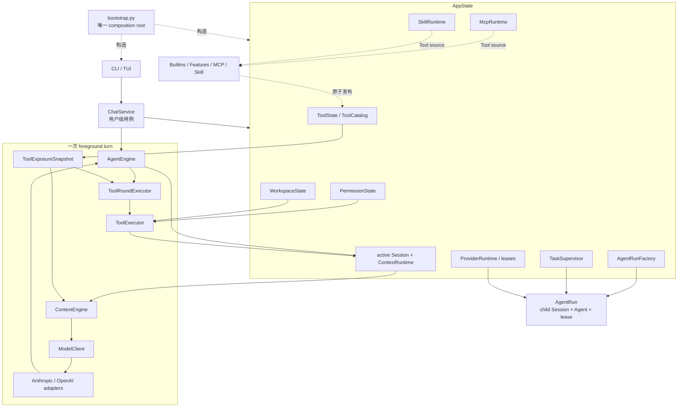

# 当前总体架构

my-code 是一个 provider-neutral 的模块化单体。核心设计只有一条主线：Session 保存已经发生的事实，Context 为一次模型调用构造投影，Agent 协调模型与工具，所有可变 runtime 能力从 AppState 进入。

## 组件图



虚线表示组装、所有权或 Tool source 发布，实线表示主要调用/数据流。精确包依赖以 `tach.toml` 为唯一机器事实来源；源码级 API 与技术所有权规则位于 `tests/architecture/`。

## 四个边界

### AppState：runtime 所有权

`runtime.state.AppState` 持有活动 Session、配对的 `ContextRuntime`、workspace、permission policy、工具目录、任务树、child run factory、MCP/Skill runtime 和 ProviderRuntime。它提供统一 operation lock 和关闭顺序，但不构造 Context、不执行 Agent loop，也不能被任意模块通过全局函数查找。

### Session：事实与持久化

`sessions.session.Session` 是 canonical `ConversationEntry[]`、context entries、compact state、工具结果和 provider replay 的唯一公开所有者。所有事实通过语义方法 persistence-first 提交；恢复先完整构造候选，再原子替换活动引用。

### Context 与 Model：请求语言

`ContextEngine` 从不可变 Session snapshot、prompt cache、工具 definitions 和模型环境构造一次性 `ModelRequest`。`model` 定义公共请求、输出和流事件；Provider adapter 只负责公共类型与 wire schema 之间的映射。

### Tool：统一能力入口

内置 Tool、Feature、MCP 和 Skill 使用同一 ToolCatalog。每个 step 捕获不可变 snapshot；模型 definitions、调用校验和 ToolRound 执行保持版本一致。所有调用经过输入校验、PermissionPolicy、Workspace 安全边界、取消和结果闭合。

## 唯一数据流

```text
用户输入
  -> Session 提交 HumanMessage
  -> ContextPlanningState
  -> ordered ModelInputItem[]
  -> Provider wire request
  -> 完整 AssistantMessage
  -> 可选 ToolRound / ToolResultBatch / Attachment
  -> 下一 step 从最新 Session 重新投影
```

流式 delta、task progress、MCP connection、Skill index 和 permission prompt 都是运行期状态，不进入 Conversation。Provider replay 是与 canonical content 分离的 opaque sidecar，只有 binding 匹配的 adapter 可以消费。

## 扩展与并发

ToolCatalog source 更新只影响下一个 step。并行 ToolRound 在安全调用之间并发，在不安全调用处设置屏障，并始终按原 ToolCall 顺序形成 batch。

Subagent 是标准 Tool 之上的纵向能力。每个 child run 使用独立 Session、Agent 组件、ContextRuntime 和 provider lease；父级只接收结构化 ToolResult 或后台 task ID。TaskSupervisor 管理进程内任务和取消树，最终结果通过 durable Attachment 进入父 Session。

## 关键生命周期

```text
启动：bootstrap -> AppState.start -> MCP / Skills -> 接受 turn

关闭：TaskSupervisor -> AgentRunFactory -> SkillRuntime
      -> McpRuntime -> ProviderRuntime
```

Session replace 会同时重建 ContextRuntime。Provider switch 原子更新前台连接和新 lease 的来源，但不改写 Session facts，也不影响已创建 child lease。

## 继续阅读

- [Runtime 与 Agent loop](01-runtime-and-agent-loop.md)
- [状态、对话与 Session](02-state-conversation-sessions.md)
- [Context 与模型输入](03-context-and-model-input.md)
- [工具、权限与工作区](04-tools-permissions-workspace.md)
- [扩展能力](05-extensions.md)
- [包边界与架构守卫](08-package-boundaries.md)
