# 当前总体架构

本文描述当前代码已经实现的运行时结构。图中的重点是组件所有权、统一 Conversation 数据流，以及 MCP、Skill、Subagent 和后台任务如何复用统一执行路径。精确的包依赖允许表仍以 `tests/architecture/dependency_rules.py` 为准。

## 总体架构图

```mermaid
flowchart TB
    Bootstrap["bootstrap<br/>唯一 composition root"]

    subgraph Host["Host 层"]
        CLI["CLI / TUI"]
        Chat["ChatService<br/>用户级用例协调"]
    end

    subgraph Runtime["Application runtime：AppState 唯一持有"]
        AppState["AppState<br/>operation lock + active Session + ContextRuntime"]
        Workspace["WorkspaceState<br/>工作区安全边界"]
        Permissions["PermissionState<br/>PermissionPolicy"]
        ToolState["ToolState<br/>versioned ToolCatalog"]
        Tasks["TaskSupervisor<br/>任务状态机 + 取消树"]
        Runs["AgentRunFactory<br/>独立 run capsule"]
        ProviderRuntime["ProviderRuntime<br/>前台 ProviderRouter"]
        Leases["ProviderLeaseRegistry<br/>每个 child run 独立 client/stream"]
        MCP["McpRuntime<br/>连接、发现、refresh、ToolSearch"]
        Skills["SkillRuntime / SkillCatalog<br/>发现、lazy load、原子 reload"]
    end

    subgraph Sources["动态能力来源"]
        Builtins["Builtin tools"]
        Features["Feature tools<br/>Todo / Subagent / Task tools"]
        McpTools["MCP Tool adapters"]
        SkillTool["Skill Tool"]
        SkillRoots["Skill sources<br/>project > user > builtin / normalized external"]
    end

    subgraph Foreground["前台 Agent turn"]
        Agent["AgentEngine<br/>turn / step 状态机"]
        Snapshot["ToolCatalogSnapshot<br/>不可变 step 工具快照"]
        Context["ContextEngine<br/>ContextPlanningState → ModelRequest"]
        Model["ModelClient<br/>provider-neutral stream"]
        Provider["Anthropic / OpenAI Responses adapters"]
        Round["ToolRoundExecutor<br/>安全并行组 + 不安全屏障"]
        Executor["ToolExecutor<br/>校验 → 权限 → hook → 执行"]
        SelectedTools["当前 ToolCatalogSnapshot<br/>tools + definitions + source + version"]
    end

    subgraph SessionBoundary["Session 边界"]
        ParentSession["Parent Session<br/>ConversationEntry[] + JSONL"]
        ChildSession["Child Session<br/>独立 transcript / JSONL"]
    end

    subgraph Subagents["Subagent / Background Task"]
        SubagentTool["Subagent Tool<br/>标准 Tool 调用"]
        Controller["SubagentController<br/>权限/工具收窄 + 预算限制"]
        ChildRun["AgentRun<br/>own Session + AgentEngine + provider lease"]
        ForegroundResult["Foreground<br/>一个闭合 ToolResult"]
        BackgroundResult["Background<br/>立即返回 task_id / run_id"]
        TaskTools["TaskList / TaskCancel"]
        Notification["完成通知<br/>下一安全 step 单次投递"]
    end

    Bootstrap -. "构造并注入" .-> CLI
    Bootstrap -. "构造并注入" .-> AppState
    CLI --> Chat
    Chat --> AppState
    Chat --> Agent

    AppState -. "owns" .-> Workspace
    AppState -. "owns" .-> Permissions
    AppState -. "owns" .-> ToolState
    AppState -. "owns" .-> Tasks
    AppState -. "owns" .-> Runs
    AppState -. "owns" .-> ProviderRuntime
    AppState -. "owns" .-> MCP
    AppState -. "owns" .-> Skills
    ProviderRuntime -. "owns" .-> Leases
    AppState -. "active" .-> ParentSession

    Builtins -. "register source" .-> ToolState
    Features -. "register source" .-> ToolState
    MCP --> McpTools
    McpTools -. "atomic source" .-> ToolState
    SkillRoots --> Skills
    Skills --> SkillTool
    SkillTool -. "feature source" .-> ToolState

    Agent -->|"每个 step 捕获"| Snapshot
    ToolState -->|"snapshot"| Snapshot
    Snapshot --> Context
    ParentSession -->|"context_entries + replacements + replay"| Context
    Context --> Model
    Model --> Provider
    Provider -->|"AssistantMessage / ToolCalls"| Agent
    Agent -->|"同一 step snapshot"| Round
    Snapshot --> SelectedTools
    Round --> Executor
    Permissions --> Executor
    SelectedTools --> Executor
    Executor -->|"每调用一个闭合 ToolResult"| Round
    Round -->|"ToolResultBatch 按调用顺序"| Agent
    Agent -->|"提交 Human / Assistant facts"| ParentSession
    Agent -->|"原子提交 ToolResultBatch → AttachmentMessage[]"| ParentSession

    Executor -->|"invoke"| SubagentTool
    SubagentTool --> Controller
    Controller --> Runs
    Controller --> Tasks
    Runs --> ChildRun
    Leases --> ChildRun
    ChildRun -. "owns" .-> ChildSession
    Controller --> ForegroundResult
    Controller --> BackgroundResult
    ForegroundResult --> SubagentTool
    BackgroundResult --> SubagentTool
    Executor -->|"invoke"| TaskTools
    TaskTools --> Controller
    Tasks -->|"terminal snapshot"| Controller
    Controller --> Notification
    Notification -->|"durable AttachmentMessage"| ParentSession

    classDef owner fill:#e8f0fe,stroke:#3367d6,color:#172b4d;
    classDef boundary fill:#e6f4ea,stroke:#188038,color:#17351f;
    classDef execution fill:#fff4e5,stroke:#e37400,color:#4a2b00;
    classDef extension fill:#f3e8fd,stroke:#9334e6,color:#32115a;

    class AppState,ToolState,Tasks,Runs,ProviderRuntime,Leases,MCP,Skills owner;
    class ParentSession,ChildSession,Workspace,Permissions boundary;
    class Agent,Snapshot,Context,Model,Provider,Round,Executor,SelectedTools execution;
    class Builtins,Features,McpTools,SkillTool,SkillRoots,SubagentTool,Controller,ChildRun,ForegroundResult,BackgroundResult,TaskTools,Notification extension;
```



## 读图约定

- 实线表示主要调用或数据流；虚线表示组装、所有权或 Tool source 注册关系。
- `AppState` 是 application-lifetime runtime 的唯一入口，但不是可被任意模块反向查找的全局 service locator。
- `Session` 拥有有序 Conversation facts，包括结构化 `AttachmentMessage`；MCP 连接、Skill 索引、任务状态和 provider stream 不进入 Conversation。
- `session.conversation` 是当前分支的完整事实序列；`session.context_entries` 是从最新 compact summary 开始派生的规划后缀。`ContextRuntime` 缓存 prompt section 与用户上下文，切换 Session 或创建 child run 时重建。
- 每个 step 只捕获一次不可变 `ToolCatalogSnapshot`。模型请求里的工具定义和随后执行 ToolCall 的实例来自同一快照。
- 所有工具来源最终都发布为标准 `Tool`，并经过同一个 `ToolExecutor` 权限、取消与错误归一化流水线。
- Subagent 使用独立 child Session、AgentEngine 和 provider lease；foreground 返回一个 ToolResult，background 先返回 task ID，完成后 pulse 无 payload revision signal，并只在安全 step 边界通过统一 attachment source 通知。父 turn 已结束时，交互式 host 会启动不追加 HumanMessage 的 continuation。

模型输入只有一条数据流：

```text
Session-owned ConversationEntry[]
        ↓ Context normalization（Attachment 原位投影为 UserInput）
provider-neutral ModelInputItem[]
        ↓ Provider adapter
Anthropic / OpenAI wire input
```

Provider 包只认识 `ModelInputItem`，永远不导入或识别 Attachment、Skill、Todo 类型。

## 关键生命周期

启动顺序：

```text
bootstrap 组装 → MCP start → Skills start → 接收用户 turn
```

关闭顺序：

```text
TaskSupervisor → AgentRunFactory / provider leases → SkillRuntime
    → McpRuntime → foreground ProviderRuntime
```

更细的职责和验证依据见：

- [01-agent-loop.md](01-agent-loop.md)：一次 turn/step 的运行过程。
- [04-tool-system.md](04-tool-system.md)：ToolCatalog、权限和并行 ToolRound。
- [06-mcp-and-tool-discovery.md](06-mcp-and-tool-discovery.md)：MCP 生命周期和动态发现。
- [12-package-boundaries.md](12-package-boundaries.md)：模块所有权和静态依赖方向。
- [13-extensibility-roadmap.md](13-extensibility-roadmap.md)：M0–M6 的需求、决策和验收证据。
- [state-management/01-state-ownership.md](state-management/01-state-ownership.md)：状态与持久化边界。
